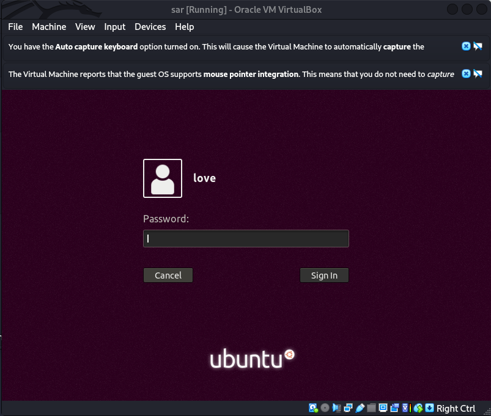
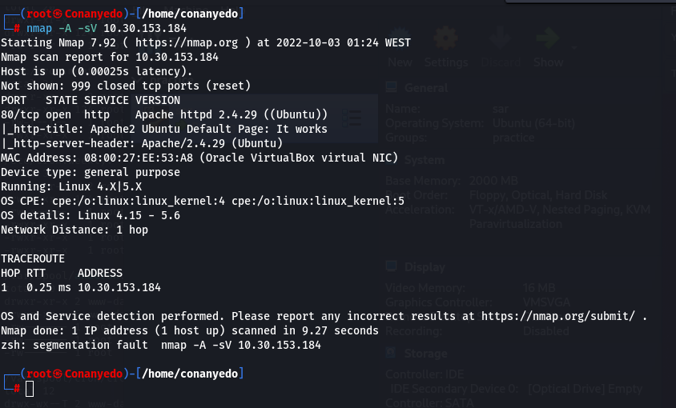

 

# Introduction

Sar is an OSCP-Like VM with the intent of gaining experience in the world of penetration testing.

This box is on the <a href="https://docs.google.com/spreadsheets/d/1dwSMIAPIam0PuRBkCiDI88pU3yzrqqHkDtBngUHNCw8/edit#gid=0">NetSecFocus Admin list</a> of OSCP-like machines. It’s <a href="https://www.vulnhub.com/entry/sar-1,425/">SAR: 1</a> from vulnhub.

## Setup Machine

First of all, I setup <a href="https://www.vulnhub.com/entry/sar-1,425/">sar machine</a> locally in a virtualMachine with the name **sar** then started it.
After starting the machine, I got its IP address using **VBoxManage** command
`VBoxManage guestproperty enumerate sar | grep IP`

 

## Enumeration

The first step to penatrate a machine is gather information about it. After getting its IP address we can scan its to get open ports and service using **nmap** command
`nmap FLAGS IPADDRESS`
> -A flag for aggressive scanning 
> -sV flag detect running services and their version 
The output shows that we have port 80 open, so we can access the ip via browser, The default page shows apache info page.
The next step is searching for more directories and files, to do that we can use **dirb** tool
`dirb http://IPADDRESS/ /path/to/wordlist`

 

